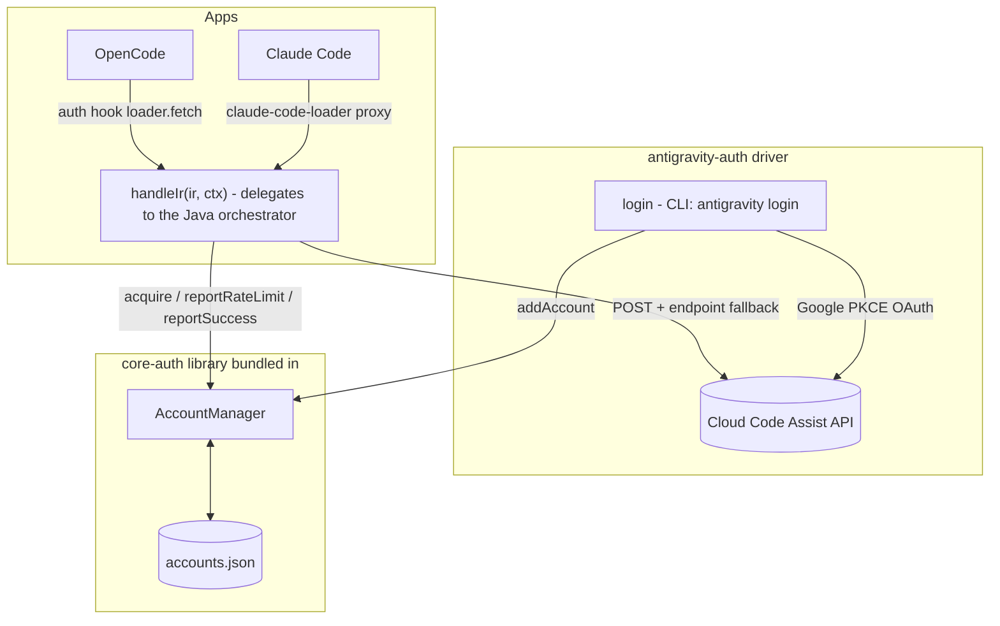

# antigravity-auth

[](https://www.npmjs.com/package/antigravity-auth)
[](https://www.npmjs.com/package/antigravity-auth)
[](https://github.com/intisy-ai/antigravity-auth/actions)

Google Antigravity provider for OpenCode and Claude Code, built as a thin driver on top of [core-auth](https://github.com/intisy-ai/core-auth). core-auth owns all the generic work (multi-account storage, selection/rotation, token refresh, and rate-limit/cooldown state) while this package supplies only the antigravity specifics: the request/response transform, the Cloud Code Assist endpoints, and the Google OAuth login. The same account pool is shared by both OpenCode and Claude Code.

## Under-the-Hood Architecture



## Driver Detail

`handleIr` delegates every decision (model/lane resolve, the account/endpoint retry+rotation loop, IR<->Gemini request/response translation, and rate-limit classification) to the Java orchestrator (`java/antigravity-provider`, TeaVM-compiled, called via `driver/javaHandle.ts`/`javaStream.ts`). The provider is IR-native: the front-door owns app<->IR translation, so no app-wire (Anthropic) format code lives here. This TS layer owns only host I/O: the fetch + proxy transport, `AccountManager` acquisition/reporting, project-context discovery, OAuth login, device fingerprinting, and the version pool.

## Structure

- `src/`
  - `index.ts`: OpenCode entry (the core-auth provider plugin)
  - `handler.ts`: Claude Code entry (`handleIr()` for the claude-code-loader proxy front-door)
  - `cli.ts`: `antigravity login | list | remove`
  - `driver/`: `index.ts` (driver + `handleIr`), `config.ts`, `models.ts`, `login.ts`, `accounts-controller.ts`, `javaHandle.ts`/`javaStream.ts` (the Java orchestrator seam)
  - `antigravity/oauth.ts`, `plugin/{request,project,fingerprint,versions,models-fetch,...}.ts`: the host I/O this driver owns (fetch-interception, OAuth, device fingerprint, version pool, model discovery); the request/response transform and decision logic lives in `java/antigravity-provider` (TeaVM-compiled, called via `driver/javaHandle.ts`)
  - `commands.ts`: cross-app slash-command definitions and their CLI actions
  - `core-auth/`: the core-auth library (git submodule, bundled into the output)
  - `core/`: shared [`intisy-ai/core`](https://github.com/intisy-ai/core) submodule (config + logging + command framework), bundled in
- `dist/`
  - bundled `index.js`, `handler.js`, `cli.js` (generated; not committed)

## Installation

### Via plugin-updater (recommended)

```bash
npx plugin-updater@latest init https://github.com/intisy-ai/antigravity-auth
```

### Via npm

```bash
npm install antigravity-auth
```

## Configuration

Config file: `<configDir>/config/antigravity.json` (edit via the loader or `/antigravity-config set`).

```json
{
  "debug": false,
  "debug_tui": false,
  "keep_thinking": false,
  "claude_tool_hardening": true,
  "claude_prompt_auto_caching": false,
  "cli_first": false,
  "account_selection_strategy": "hybrid",
  "default_retry_after_seconds": 60,
  "max_backoff_seconds": 60,
  "request_jitter_max_ms": 0,
  "signature_cache": {
    "enabled": true,
    "memory_ttl_seconds": 3600,
    "disk_ttl_seconds": 172800,
    "write_interval_seconds": 60
  },
  "logging": true
}
```

| Key | Default |
| --- | --- |
| `debug` | `false` |
| `debug_tui` | `false` |
| `keep_thinking` | `false` |
| `claude_tool_hardening` | `true` |
| `claude_prompt_auto_caching` | `false` |
| `cli_first` | `false` |
| `account_selection_strategy` | `"hybrid"` |
| `default_retry_after_seconds` | `60` |
| `max_backoff_seconds` | `60` |
| `request_jitter_max_ms` | `0` |
| `signature_cache` | `{"enabled":true,"memory_ttl_seconds":3600,"disk_ttl_seconds":172800,"write_interval_seconds":60}` |
| `logging` | `true` |

## Commands

| Command | Description | Arguments |
| --- | --- | --- |
| `/antigravity-config` | View and change antigravity configuration | `list | get <key> | set <key> <value>` |
| `/antigravity-accounts` | List signed-in Antigravity accounts |  |

## Dependencies

- `core`
- `core-auth`
- `sync-bridge`

## Logging

Logs are written to `<configDir>/logs/YYYY-MM-DD/antigravity-auth-HH-MM-SS.log` and are toggled by
this plugin's `logging` config (default on). Console mirroring is global, off by default,
and controlled by the shared `config/settings.json` `logConsole` flag.

## License

MIT.
